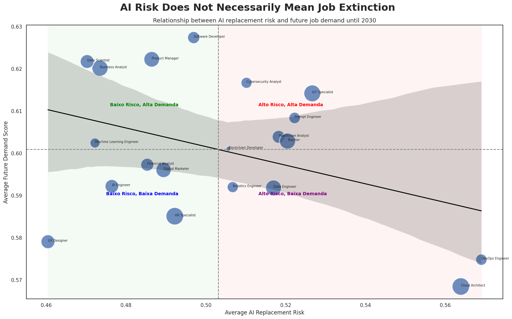

# Relatório

## Identificação

- **Nome**: Rafael Benjamin Bombach
- **Cartão UFRGS:** 00342854

## Dados utilizados

1. **Dataset 1**: https://www.kaggle.com/datasets/muhammadwaqas023/ai-impact-in-future-on-jobs-market-in-2030
    * **Descrição curta**: Conjunto de dados contendo informações sobre profissões, risco de substituição por inteligência artificial, demanda futura prevista, salários, habilidades requeridas e tendências de contratação até 2030.

## Código-fonte da visualização

- **Arquivo principal**: LabVisu.ipynb

## Imagem da visualização gerada

## Descrição da visualização

### Legenda (*caption*)

   O eixo horizontal representa o risco médio de substituição por inteligência artificial, enquanto o eixo vertical representa a demanda futura prevista para cada profissão. Cada ponto corresponde a uma profissão e o tamanho da bolha é proporcional ao salário médio. As linhas tracejadas indicam os valores médios e ajudam a dividir o gráfico em regiões com características semelhantes.

### Conclusão demonstrada pela visualização

   A visualização mostra que o impacto da IA no mercado de trabalho não é tão simples quanto apenas substituir pessoas. Existem profissões com alto risco de automação que ainda apresentam uma demanda futura elevada, indicando que muitas funções devem passar por mudanças em vez de desaparecer completamente. Também é possível perceber que profissões com salários maiores aparecem em diferentes situações, mostrando que o salário, sozinho, não determina o risco ou o crescimento esperado da profissão.
