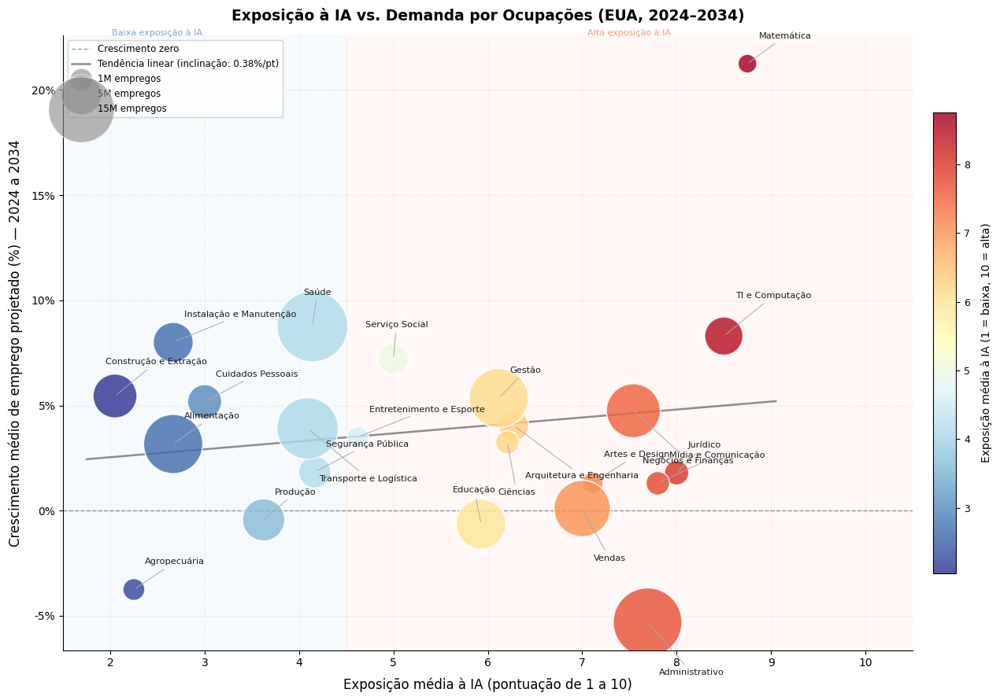

# Relatório

## Identificação

- **Nome**: Rafael Benjamin Bombach
- **Cartão UFRGS:** 00342854

## Dados utilizados

1. **Dataset 1**: https://github.com/karpathy/jobs/blob/master/occupations.csv
    * **Descrição curta**: Dados do BLS (Bureau of Labor Statistics dos EUA) com informações de 342 ocupações: salário mediano, escolaridade exigida, volume de empregos em 2024 e projeção de crescimento até 2034, organizadas em 25 categorias profissionais.
   **Dataset 2**: https://github.com/karpathy/jobs/blob/master/scores.json
    * **Descrição curta**: Pontuação de exposição à IA (escala de 1 a 10) para cada uma das 342 ocupações, acompanhada de uma justificativa textual. Quanto maior a nota, maior a substituibilidade da ocupação por inteligência artificial.

## Código-fonte da visualização

- **Arquivo principal**: laboraorio.ipynb

## Imagem da visualização gerada

## Descrição da visualização

### Legenda (*caption*)

   O gráfico de bolhas mostra, para cada grande categoria de ocupações norte-americanas, a relação entre a exposição média à IA (eixo X, escala de 1 a 10) e o crescimento projetado de emprego entre 2024 e 2034 (eixo Y, em %). O tamanho de cada bolha é proporcional ao volume total de trabalhadores na categoria em 2024, e a cor vai do azul (baixa exposição) ao vermelho (alta exposição). A linha tracejada horizontal marca crescimento zero; a linha diagonal representa a tendência linear entre as variáveis.

### Conclusão demonstrada pela visualização

   O gráfico mostra uma tendência clara: ocupações com alta exposição à IA tendem a ter perspectivas de crescimento menores. Categorias grandes como Administrativo e Vendas — repletas de tarefas repetitivas e baseadas em processamento de informação — aparecem na zona de risco, enquanto Saúde, Construção e Serviço Social, que dependem de presença física e julgamento humano, lideram o crescimento projetado.
O caso mais interessante é o de TI e Computação, que mesmo com exposição moderada-alta apresenta crescimento acima da média. Isso sugere que a IA, nesse setor, amplifica o trabalho humano em vez de substituí-lo, o que contraria a intuição de muita gente e indica que o impacto da IA no mercado de trabalho é mais seletivo do que catastrófico.
